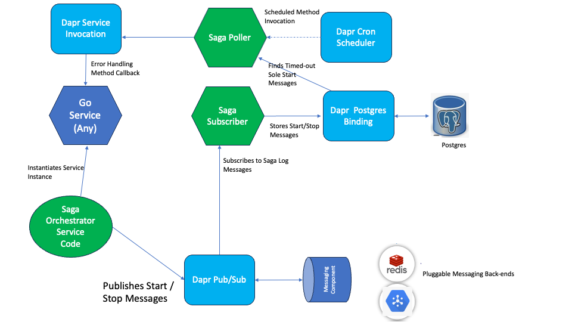

# Dapr Example Project SagaExecutor

This project was written as This project has been written to demonstrate the use of Dapr Building Blocks using the Go SDK. It delivers a Saga Executor Orchestrator:

