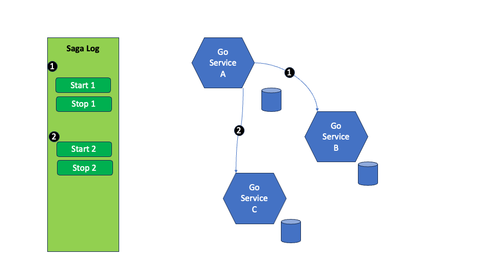
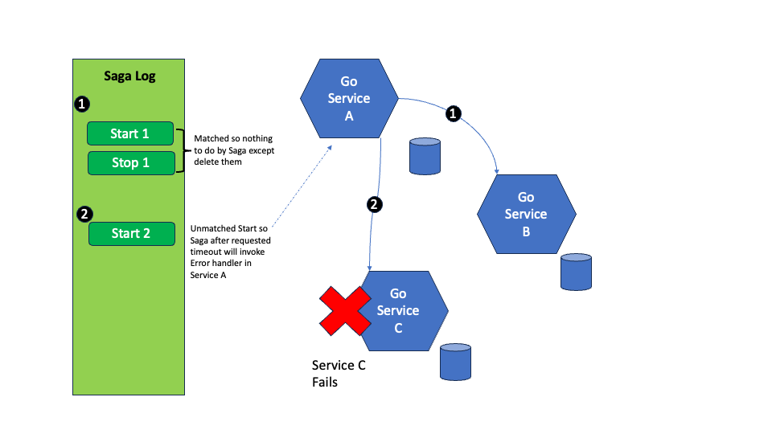

# Dapr Example Project SagaExecutor

This project has been written to demonstrate the use of Dapr Building Blocks using the Go SDK. It delivers a Saga Executor Orchestrator Service. The high-level solution is shown below:


There are 3 logical components of this solution:
1. The Saga Service Code which provides an interface and is instantiated into the Calling Go Service code
2. The Saga Subscriber 
3. The Saga Poller

The Saga components are shown in Green and the Dapr building blockes in Blue.

The client Go service code is linked with the Saga Service code. 

This provides methods for the client service to publish Start & Stop messages to a queue managed by Dapr. This ensure that the latency to the consuming Go service is minimal.

The Saga Subscriber component reads these messages and stores them in a database, the Saga Log, using a Go native Postgres driver. Originally, I used the Dapr DataStore, but this is process specific so I switched to Postgres. Only Start messages are stored and these are deleted when a Stop message is received.

The Saga Poll queries the State store for Start messages that exist and for which the timeout period has elapsed. When found the client’s service call-back method recorded in the Start message is invoked. If successful the Start message in the state store is deleted to avoid a repeat of the call-back method.

These components use Darp capabilities to reduce the amount of code required:
```
gocloc .
-------------------------------------------------------------------------------
Language                     files          blank        comment           code
-------------------------------------------------------------------------------
Go                              10            179             73            693
YAML                            13              9              1            384
Markdown                         1             29              0            146
Makefile                         4              1              0             25
-------------------------------------------------------------------------------
TOTAL                           28            218             74           1248
-------------------------------------------------------------------------------
```

Dapr allows you to deploy the same microservices from your local machines to the cloud. Correspondingly, this project has instructions for deploying [locally](#Run-Locally) or in [Kubernetes](#Run-in-Kubernetes). 

## Run locally

To demonstrate this project running locally it can be run on your machine as follows:

```
From the sagaexecutor directory:
cd test_clients
dapr init --dev   # if dapr is not already running
./setuplocal.sh   # this creates a Postgres docker container and initialises it
dapr run -f dapr
```
This should start the two core Saga components, the Poller and the Subscriber plus the test_server example code. The output should look like this and will run until you terminate it.
```
<snip>
== APP - server-test == 2024/01/01 09:14:01 Sleeping for a bit
== APP - sagapoller == 2024/01/01 09:14:06 Hello I am called by cron!
== APP - sagapoller == 2024/01/01 09:14:06 Returned 0 records
== APP - sagapoller == 2024/01/01 09:14:11 Hello I am called by cron!
== APP - sagapoller == 2024/01/01 09:14:11 Returned 0 records
== APP - server-test == 2024/01/01 09:14:11 Successfully pubished a start message for later callback
== APP - sagasubscriber == eventHandler Ordering Key = 1
== APP - sagasubscriber == 2024/01/01 09:14:11 App_id = server-test
== APP - sagasubscriber == 2024/01/01 09:14:11 eventHandler: Message:{server-test test1 abcdefgh1235 callback {"fred":1} 10 true 0001-01-01 00:00:00 +0000 UTC}
== APP - sagasubscriber == 2024/01/01 09:14:11 Start Storing key = server-testtest1abcdefgh1235, data = {"app_id":server-test,"service":test1,"token":abcdefgh1235,"callback_service":callback,"params":{"fred":1},"event": true,"timeout":10,"logtime":2024-01-01 08:14:11.823429 +0000 UTC}
== APP - sagasubscriber == 2024/01/01 09:14:11 DB:Store Key = server-testtest1abcdefgh1235
== APP - server-test == 2024/01/01 09:14:11 Successfully pubished Second start message callback
== APP - server-test == 2024/01/01 09:14:11 Successfully pubished Second stop message to cancel the start
== APP - server-test == 2024/01/01 09:14:11 setting up handler
== APP - sagasubscriber == eventHandler Ordering Key = 2
== APP - sagasubscriber == 2024/01/01 09:14:11 App_id = server-test
== APP - sagasubscriber == 2024/01/01 09:14:11 eventHandler: Message:{server-test test1 abcdefgh1236 callback {"steve":1} 20 true 0001-01-01 00:00:00 +0000 UTC}
== APP - sagasubscriber == 2024/01/01 09:14:11 Start Storing key = server-testtest1abcdefgh1236, data = {"app_id":server-test,"service":test1,"token":abcdefgh1236,"callback_service":callback,"params":{"steve":1},"event": true,"timeout":20,"logtime":2024-01-01 08:14:11.867344 +0000 UTC}
== APP - sagasubscriber == 2024/01/01 09:14:11 DB:Store Key = server-testtest1abcdefgh1236
== APP - sagasubscriber == eventHandler Ordering Key = 3
== APP - sagasubscriber == Stop so will delete state with key: server-testtest1abcdefgh1236
== APP - sagasubscriber == 2024/01/01 09:14:11 App_id = server-test
== APP - sagasubscriber == 2024/01/01 09:14:11 eventHandler: Message:{server-test test1 abcdefgh1236   0 false 0001-01-01 00:00:00 +0000 UTC}
== APP - sagasubscriber == 2024/01/01 09:14:11 DB:Delete Key = server-testtest1abcdefgh1236
== APP - sagasubscriber == 2024/01/01 09:14:11 Deleted Log with key server-testtest1abcdefgh1236
== APP - sagapoller == 2024/01/01 09:14:16 Hello I am called by cron!
== APP - sagapoller == 2024/01/01 09:14:16 Returned 1 records
== APP - sagapoller == 2024/01/01 09:14:16 time_tmp = 2024-01-01 081411.823429 +0000 UTC}. time_tmp = 2024-01-01 081411
== APP - sagapoller == 2024/01/01 09:14:16 App_id = server-test
== APP - sagapoller == 2024/01/01 09:14:16 Token = abcdefgh1235, Elapsed value = 5.007655s, Compared value = 10
== APP - sagapoller == 2024/01/01 09:14:21 Hello I am called by cron!
== APP - sagapoller == 2024/01/01 09:14:21 Returned 1 records
== APP - sagapoller == 2024/01/01 09:14:21 time_tmp = 2024-01-01 081411.823429 +0000 UTC}. time_tmp = 2024-01-01 081411
== APP - sagapoller == 2024/01/01 09:14:21 App_id = server-test
== APP - sagapoller == 2024/01/01 09:14:21 Token = abcdefgh1235, Elapsed value = 10.010032s, Compared value = 10
== APP - sagapoller == 2024/01/01 09:14:21 Token abcdefgh1235, need to invoke callback callback
== APP - sagapoller == sendCallBack invoked with key server-testtest1abcdefgh1235, params = {server-test test1 abcdefgh1235 callback  10 false 2024-01-01 08:14:11 +0000 UTC}
== APP - sagapoller == sendCallBack App_ID = server-test, Method = callback
== APP - server-test == Yay callback invoked!
== APP - server-test == transaction callback invoked {server-test test1 abcdefgh1235 callback  10 false 2024-01-01 08:14:11 +0000 UTC}
== APP - server-test == 
== APP - sagapoller == 2024/01/01 09:14:21 DB:Delete Key = server-testtest1abcdefgh1235
== APP - sagapoller == Deleted Log with key: server-testtest1abcdefgh1235
== APP - sagapoller == 2024/01/01 09:14:26 Hello I am called by cron!
== APP - sagapoller == 2024/01/01 09:14:26 Returned 0 records
```

## Run in Kubernetes

To run the same code in Kubernetes, 

## Usage Scenarios

Assume a service is having to call two other services as part of a logical transaction:



In this case everything is ok so the Stops logged by Service A will cancel out the Starts by the Saga Subscriber. There will be nothing to recover. The Saga Scheduler will ensure that the Saga Log is empty after Service A has successfully completed both calls.




In this case something has gone wrong with Service C. Assuming retries have happened and Service C is still not responding, the the Saga Poller will detect that there is an unmatched Start 2 message and after the configured timeout it will call the error call-back handler passed in the Start 2 message. This message can contain json data in addition to a GUUID token based by Service A that will enable Service A to take the appropriate error recovery. This will be service specific, but could involve reversing the change made by invoking Service B again.

At the end of the recovery processing the Saga Log will be empty. The Start 2 message will remain in the Saga Log until he error handler method in Service A has been invoked.